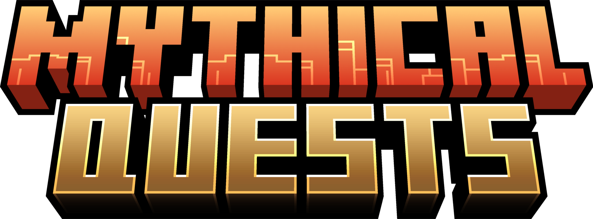


# Downloads
* For versions 1.20.2 and above.
* There are 2 downloads available:

Pack Name|Description
------------- | -------------
``MythicalQuests_v1.2.1.zip``  | Everything the pack offers.
``MythicalQuests_v1.2.1_barebones.zip``|Use after creating all NPCs and quests. Removes menus, editors and other features, only packing the bare minimum to let already made quests function.

* After downloading a desired pack, directly drop the zip folder into the datapack folder for your world.
<br/>
<br/>


# Settings

* A few settings to help customize Mythical Quests to your liking. They can be toggled as such:
```mcfunction
scoreboard players set <SETTING> myquest.settings <NUMBER>

## <NUMBER>
# 0 = false
# 1 = true
```

``<SETTING>`` | Function| Default State
---|---|---
``$consumeitems``| Consumes hand item when added to editor, basically helps prevent hotbar clutter|true
``$dialogueno``| Adds numbering to NPC dialogues, showing current dialogue number and total dialogue number|true
``$fastforward``| Allows skipping wait times in scripts by right clicking the NPC holding the queststage, basically allows you to fast forward NPC dialogue|false

<br/>
<br/>


# Introduction
* This section will help you get familiar with terms used in this documentation and give you a general idea of how quests are created and organized.
* The details of using the pack will be mentioned later.

<br/>

## Queststage


### Queststage

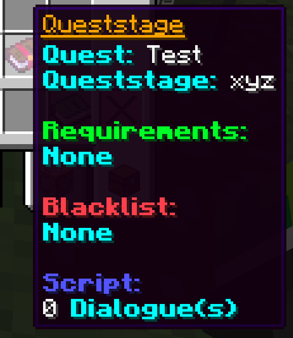

  * This is the functional unit of the pack. It is the part of a quest a single NPC holds.
  * A Queststage can have the following components:

 Name | Description
 ---|---
 Quest|Holds the name of the Quest the Queststage belongs to. Queststages are grouped in searches with the help of Quest names so be consistent!
 Queststage| Name of the Queststage.
 Requirements|Allows checking for quest progress in quests or matching the result of a command to a given value. If requirements are present, all must be met to start the Queststage. (i.e. check the no. of a certain item on the player)
 Blacklist|Same as requirements, but if the blacklist is met, Queststage is not started.
 Script|Holds Commands, Dialogues, Click Events and delays in-between them.
 <br/>

## NPCs
 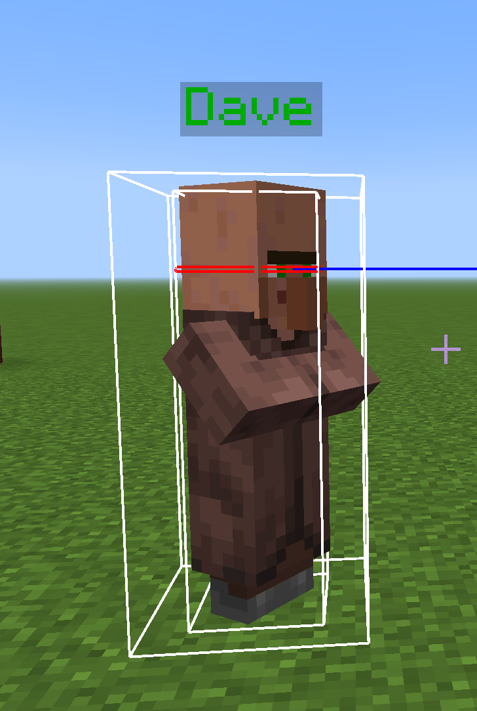

* For a NPC, you are supposed to provide the visual "model" for an npc.
* The "model" then needes to be covered by an interaction entity which serves as the actual NPC for the pack.
* Conversation with NPCs is triggered by right clicking the interaction entity.
* A NPC may have multiple queststages from a single quest and multiple queststages from different quests.
* In case there end up being ***multiple valid*** queststages that a player can trigger from a NPC, the queststage added ***LAST*** is selected.

<br/>

## Quest Progress
 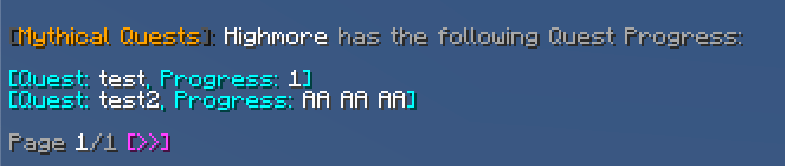
 
* An assignable stat for a **Quest** that is compatible with the questbook.
* It is recommened you use this for tracking the progress of a player in a quest.
* Quest Progress may or may not be rewarded in a script.
* Stored as a string.  ``1``, ``hello``, ``"this is an example"`` are valid values for quest progress. (All **numbers** are stored as **strings**)
<br/>
<br/>

# Using the Pack
 
* To start, in an open area, summon the editor by running the following command. You can summon multiple editors for convenience.
  ```mcfunction
   function myquest:api/editor
  ```
   
* You also want to get yourself a wand, which you can get by running the following command
  ```mcfunction
  function myquest:api/wand
  ```
   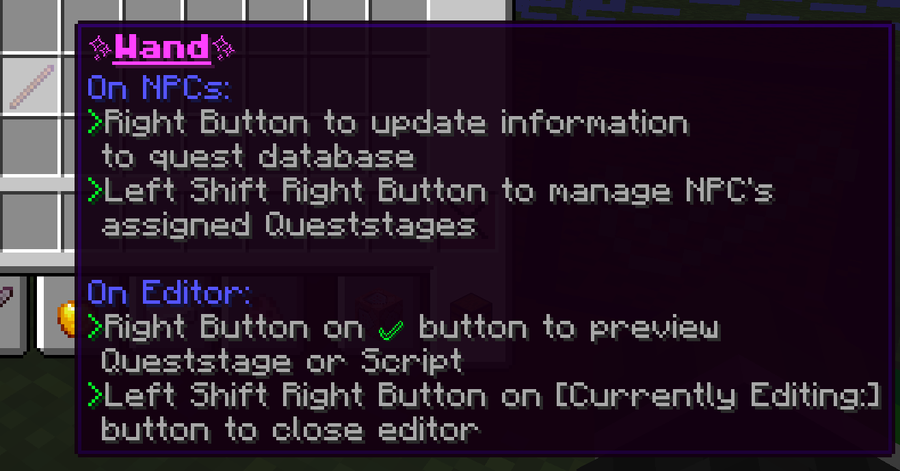

 ## Editor
   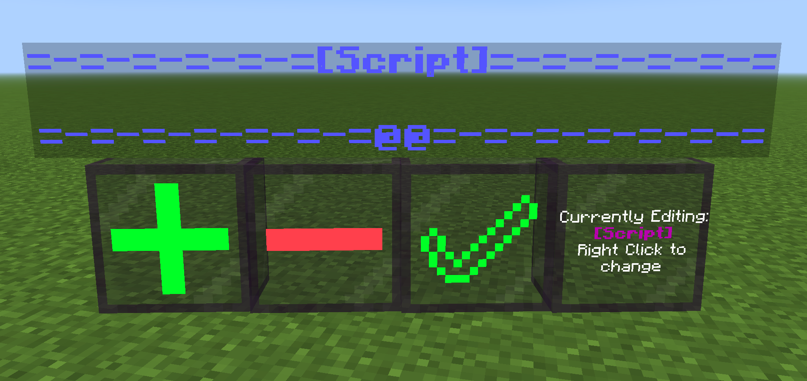
   
   * The editor is used to generate parts of the queststage and the queststage itself. It has a few buttons with their functions listed below.
     
     Button|Function
     ---|---
     ``+``| Adds an element to the bottom of the currently selected part of the queststage. Right Click with element in hand.
     ``-``| Removes the bottom most element of the currently selected part of the queststage. Right click to use.
     ``✅``| Generates the part of the queststage if all necessary elements are present. Right click with an ***empty*** hand.
     ``[Currently Editing...]``| Cycles through the part of the queststage the editor can make. Right click to use.
   * You can close the editor using the wand.
   * You can frankenstein parts of the queststage after making them without issue.

     ### Script
        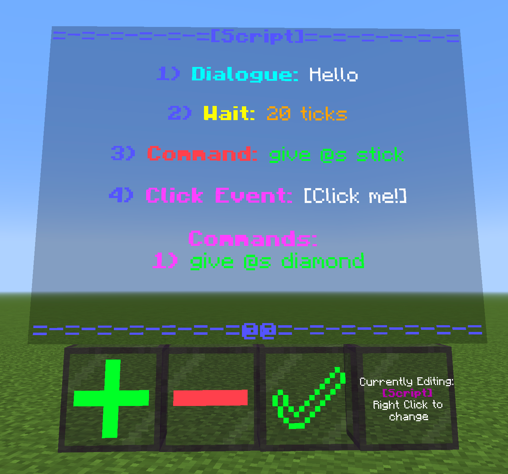

        * The script is played for the player when a queststage begins.
        * This is a ***NECESSARY*** part of all queststages and every queststage must have one.
        * To add elements to the script, Right Click the ``+`` button with the element in hand.
        * For elements needing command blocks, ``Ctrl + Pick Block`` to grab a placed command block with it's data, then Right Click the ``+`` button with it in hand.
        * The elements that can be added to the script are listed below.

          Element|Description|How to add
          ---|---|---
          Dialogue|Plays a tellraw command to the player with added dialogue number (if enabled), prefix and suffix and NPC name.|Write a tellraw command in an ***impulse*** command block as such ``tellraw @p <JSON text>``
          Wait|Waits a specified amount of ticks before continuing with the rest of the script.| Write a number in a writable book on the first page and nothing else. That number is the amount of ticks the script will wait.
          Command|Runs a command as the player at the player|Write the command in a chain command block.
          Click Event| Displays a clickable text in the chat. Stops the script until it is clicked OR the next element is also a click event. Can hold commands to be run on the player after clicking.|Covered separately in it's own section.
          
       * In the ***Script*** mode only, you may access more detailed chat menus for adding/removing/replacing elements in the script.
       * To access the detailed menu to add/replace an element anywhere in the script, ``Sneak + Right Button`` on the ``+`` button while holding your element. The menu is self-explanatory.
       * To access the detailed menu to remove an element anywhere in the script, ``Sneak + Right Button`` on the ``-`` button. The menu is self-explanatory.
       * You can preview the script after making it using the wand. (look at the description of the wand)
       * Click on the ``✅`` button with an empty after adding all elements to get a Script item.
       * You may also add the Script item to the ``+`` button to add it to the editor again for editing.
       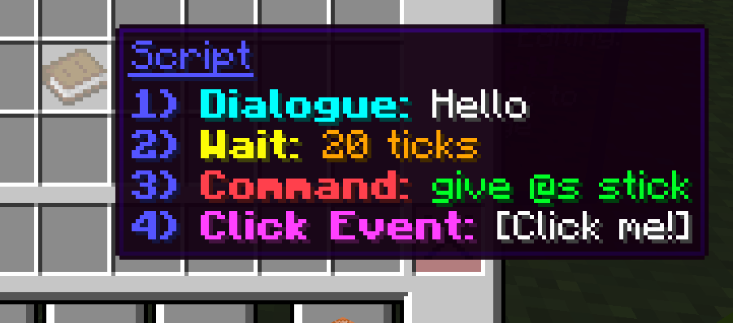

     ### Requirements & Blacklist
     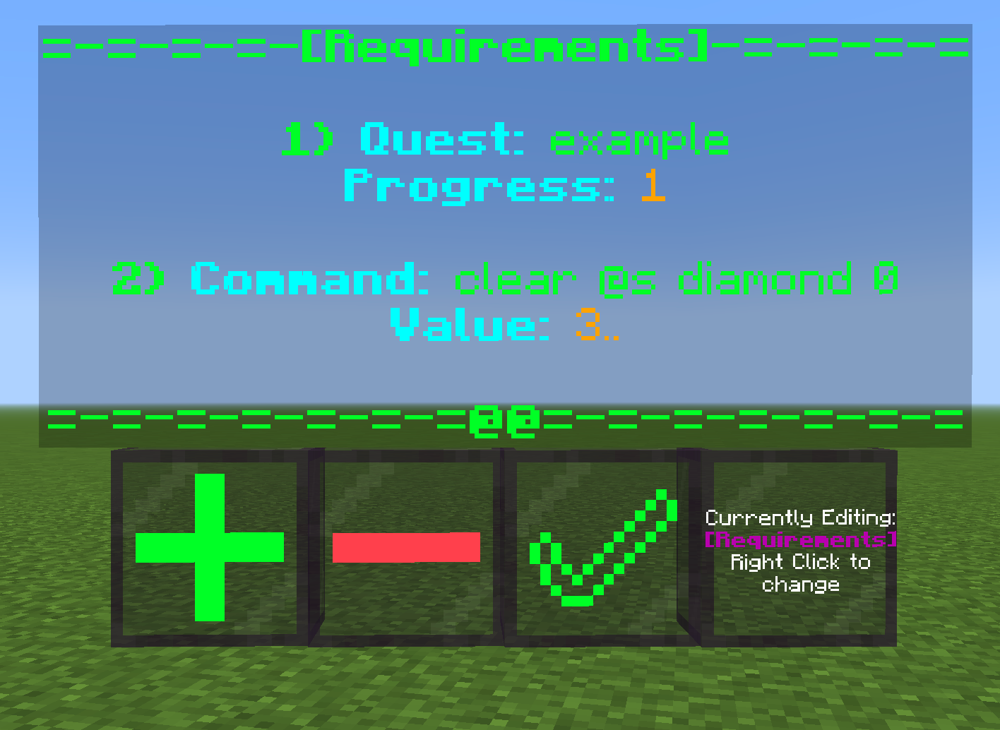 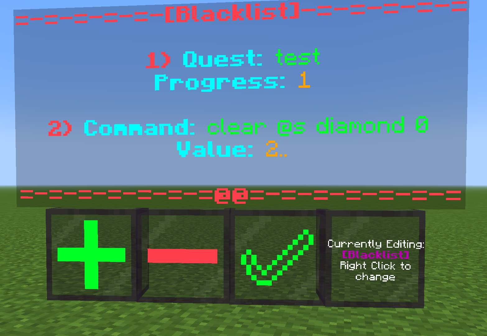
     
     * These are not necessary for a queststage.
     * Checking for quest progress is an option. To set the progress (this is just a stat you can track according to a quest) for any Quest for a player, use the following command:
       ```mcfunction
       function myquest:api/player/setprogress {quest:"QUEST NAME",progress:"PROGRESS"}
       # Both quest name and progress are entirely set by you.
       # There are a few special keywords for progress in-case you plan to use the Questbook.
       # You should skip ahead to the Questbook section to learn them if you plan to
       # use the questbook

       ```
     * It is recommended to use the setprogress command inside scripts or in click events to award progress.
     * If a player leaves the game while a script is being read, it is wiped and the player must restart the queststage.
     * Thus it is HIGHLY advised that quest progress is rewarded at the very end of scripts, so that there are no conflicts with restarting the queststage incase the player leaves in the middle.
     * Elements are added the same to to these as to the script.
     * The following elements may be added to Requirements/Blacklist
         
         Element|Description|How to make
         ---|---|---
         Quest Progress|Checks for progress in a quest.|In a writable book, on the first page, write in the following format ``quest:"QUEST NAME",progress:"PROGRESS"``. Use keyword ``any`` in progress to check for ANY progress in that quest.
         Command|Runs a command as the player at the player and matches it's result value to a given value. Useful to check for items on the player and tags on the player.|Write the command you want in a chain command block. Write the value in a writable book, on the first page. Hold the book in your offhand and the chain command block in your mainhand. Value may be a single number like ``1`` or a range like ``1..2`` or ``1..``.
       
     * Don't forget to grab the generated Requirements/Blacklist item by Right Clicking the ``✅`` button.
     * Similar to the Script item, they can also be added back to the editor through the ``+`` button.
       
        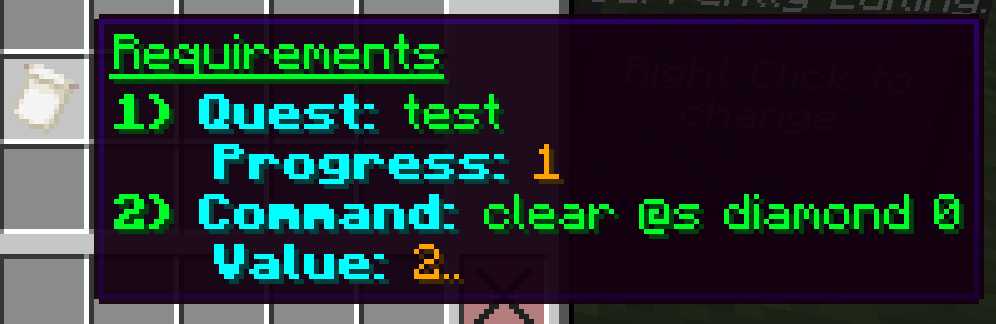 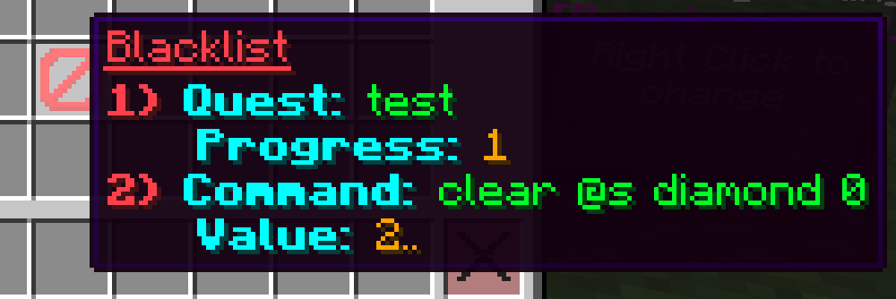
        
     ### Click Event
      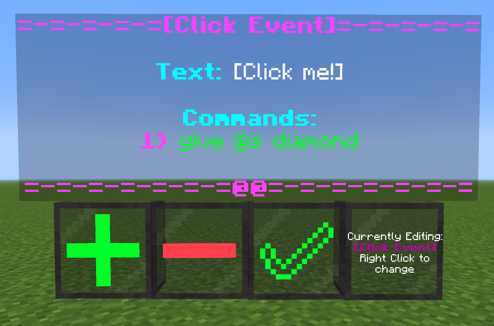
      
     * This is an optional element in a script
     * It's behaviour is described in the Script section.
     * It is not necessary to have commands for all Click Events.
     * The following elements can be added to the Click Event:
     
     
     Element|Description|How to Make
     ---|---|---
     Text|The actual clickable text|Use a impulse command block, same as dialogue in Script.
     Commands|Runs commands as the player at the player|Use a chain command block, same as Commands in Script.

     * Grab the Click Event Item and add it like any other element to a Script.
       
       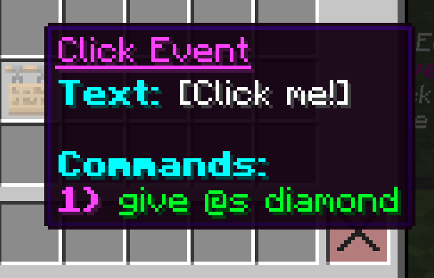
       
     ### Queststage
       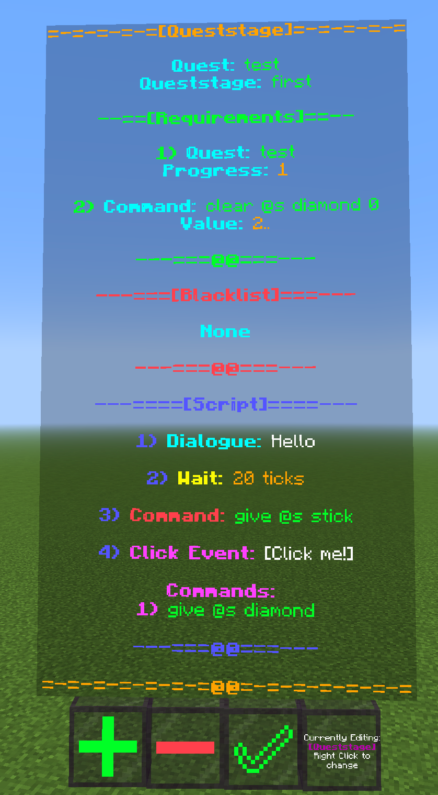
       
     * A Script is ***Necessary*** for a queststage. Requirements and Blacklist are optional.
     * They can be added by holding their respective items and Right Clicking the ``+`` button.
     * A queststage must also have a Quest name and a Queststage name.
     * They can be added with a writable book. On the first page of the writable book, write in the following format: ``quest:"QUEST NAME",queststage:"QUEST STAGE NAME"``
     * After all needed parts of the queststage are added, get the queststage item by right clicking the ``✅`` button with an empty hand.
     * You can preview the Queststage similarly to a Script using the wand. Previewing a Queststage takes into account the Requirements and Blacklist if present.
     * Parts of a queststage may be separated again by adding it to the editor and using the ``-`` button, which will return the individual parts after removing them.
       
        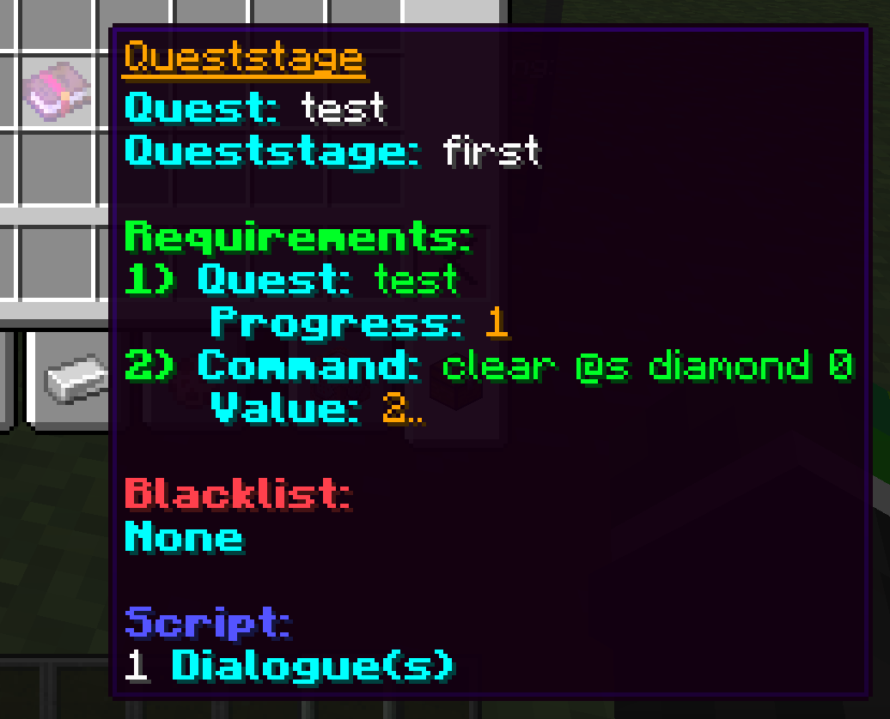
       
 ## NPCs
   
   
 * To assign queststages, you must create a NPC.
 * Set your visual model for the npc. Stand in the middle of the "model" and type the following command to spawn a NPC interaction entity at your location.
 
  ```mcfunction
  function myquest:api/npc/summon {height:<HEIGHT>,width:<WIDTH>,name:'<JSON TEXT>'}

   ## <Height>
   # Any decimal number. It is the height of the interaction entity spawned.
   ## <Width>
   # Any decimal number. It is the width of the interaction entity spawned.
   ## <JSON TEXT>
   # What you want to add in JSON text format, same as you would set an entity's CustomName.
  ```
* ```Sneak + Right Button``` on an NPC interaction entity to add a queststage to it. It's name is used as the NPC name in dialogue.
* The name of the interaction entity can be changed later with ```data modify entity UUID CustomName set value '<NEW NAME>'``` like any other entity, same with it's height and width and even position with teleport.
* If you change the name or the position of the interaction entity, The quest database MUST be updated, so right click it with the wand.
* You can see all the queststages assigned to an NPC and also retrive them by opening a chat menu. ```Sneak + Right Button``` on an NPC with the wand to open the menu.

   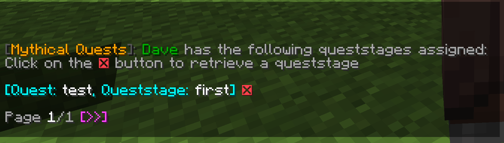

 ## Useful commands
 * The pack contains several useful commands, all are listed below.

   ### Forcestart Queststage
   Force Start a queststage for a player, ignoring the NPC, requirements and blacklist of the queststage. Useful for making branching quest options.
   
   ```mcfunction
   function myquest:api/player/forcestart {quest:"QUEST NAME",queststage:"QUEST STAGE NAME"}
   ```

   ### Delete Progress
   Delete a player's progress in a particular quest.
   
   ```mcfunction
   function myquest:api/player/deleteprogress {quest:"QUEST NAME"}
   ```

   ### Check Progress
   Helpful to check a player's quest progress from outside the pack for integration.
   Firstly, set the progress you want to check by doing the following

   ```mcfunction
   data modify storage myquest:api checkprogress set value [{quest:"QUEST NAME 1",progress:"PROGRESS 1"},{quest:"QUEST NAME 2",progress:"PROGRESS 2"},...]
   ## Progress
   # Set progress to "any" to check for ANY progress in that quest, regardless of what it is.
   ```
   After setting the progress to be checked, run the following command ***as the intended player***

   ```mcfunction
   function myquest:api/player/checkprogress

   ## How to check result
   # If score $found on scoreboard myquest.zprivate matches 1, progress matches.
   # If score $found on scoreboard myquest.zprivate matches 0, progress does not match
   ```
   
   ### Get Quest Name
   Get the name of the quest the ongoing script belongs to. Use this command inside a script.
   
   ```mcfunction
   function myquest:api/player/getcurrentquest

   # Name of the quest will be stored under storage myquest:api quest
   data get storage myquest:api quest
   ```

   ### Change NPC name in a Script
   Helpful to change the name of the NPC displayed in dialogue in a script, while the script is ongoing. DOES NOT actually change the NPC's name. Simulates multiple dialogue speakers.
   
   ```mcfunction
   function myquest:api/npc/dialoguename {name:'<JSON TEXT>'}
   
   # Name in the same format as a CustomName for an entity
   ```
   ### One-time NPC dialogue
   Reads one dialogue with the current NPC name. Helpful in providing one differing dialogue in multiple click events without having to start separate queststages.

   ```mcfunction
   function myquest:api/npc/dialogue {dialogue:'<JSON TEXT>'}

   #Dialogue in the same format as tellraw, but without the tellraw @p
   ```
   ### Kill a NPC
   Kills a NPC interaction entity ***and*** wipes all the queststages related to it.
   Execute as the interaction entity and run
   ```mcfunction
   function myquest:api/npc/kill
   ```

   ### Menus
   The following commands bring up various menus which are useful for viewing and managing your work!

    #### Player Progress
    * Check a player's progress whether they are online or offline. Uses their username.
    * In case a player changes their username, it will not update for the datapack until the player tries to either open a questbook or interact with a NPC. Their progress can still be accessed through their old username
      
      ```mcfunction
      function myquest:api/search/player {name:"PLAYERNAME"}
      ```
      
    #### Queststages
    * Search through queststages with the help of the Quest name.
    * Also allows teleporting to the NPC with the queststage.
      
      ```mcfunction
      function myquest:api/search/queststages {quest:"QUEST NAME"}
      ```
      
## Questbook
* The questbook allows players to easily see the next objective in a quest and keep track of quests they can started, have started and have completed.
* Queststages are an invisible value and players cannot see them in the questbook, the only values that they can see are the Quest name and some cases of Quest Progress.
* You can get a questbook by running the following command:
  
  ```mcfunction
  function myquest:api/questbook/get
  ```
 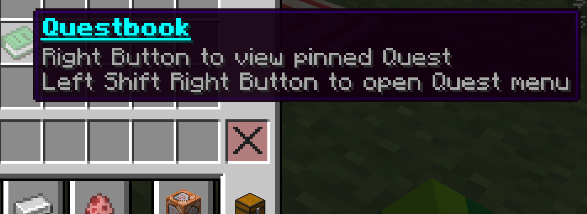
 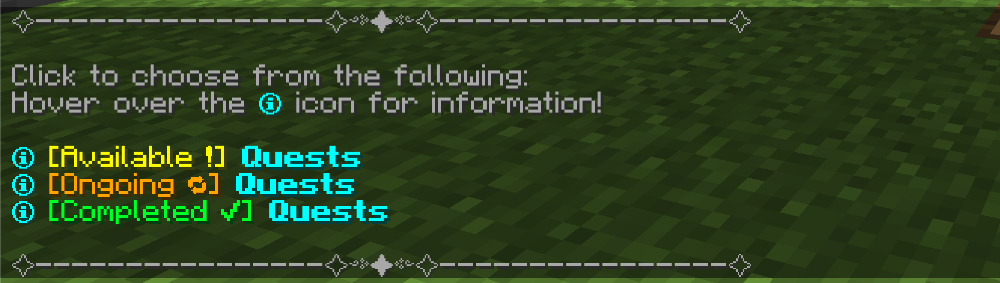
 
* If the progress of a player in a quest is set to ``none`` it sorts into the Available Quests tab. It is recommened to reward ``none`` progress to guide players towards quests they should do, whether externally or at the end of other quests.
* If the progress of a playe rin a quest is set to ``complete`` it sorts into the Completed Quests tab. Reward this progress to indicate that a quest is completed.
* Any other value of progress is sorted into the ongoing section.
* Each value of progress can hold a corresponding Objective which guides players.
* To assign an objective for a value of progress, firslty write it in an impulse command block in the same format as dialogue:- ``tellraw @p {"text":"example"}``
* ``Ctrl + Pick Block`` the command block, then while holding it execute the following command:
  
  ```mcfunction
  function myquest:api/questbook/addobjective {quest:"QUEST NAME",progress:"PROGRESS"}

  # The tellraw in the command block will be assigned as the objective for PROGRESS in Quest QUEST NAME
  # This command will also override any previously assigned objective for that PROGRESS value
  ```
  
* You may remove an objective by running the command:
  ```mcfunction
  function myquest:api/questbook/removeobjective {quest:"QUEST NAME",progress:"PROGRESS"}
  ```

* You can view all of the objectives of a Quest in one menu by running the following command

  ```mcfunction
  function myquest:api/search/objectives {quest:"QUEST NAME"}
  ```
   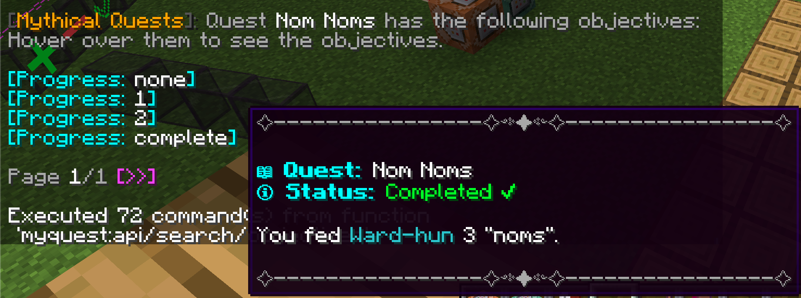

## Misc
* You can assign a prefix and suffix before and after NPC names in dialogues by running the following
  
  ```mcfunction
  data modify storage myquest:api prefix set value '{"text":"example"}'
  data modify storage myquest:api suffix set value '{"text":"example"}'

  ## By default, suffix is set to {"text":": ","color":"gray"}
  # Dialogues are displayed as such DIALOGUENUMBER(if enabled) PREFIXNPCNAMESUFFIX DIALOGUE
  ```

  
   
   
      
      
   

   


   

   
   
   
  

       
          
                                              
           
     
   


